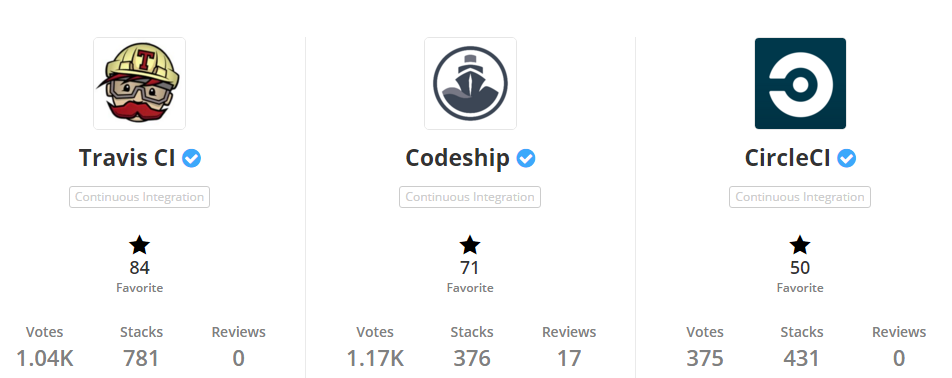

## ci-golang-test

| CI Monitor  | Build Status                                                                                                                                                                        |
|:------------|:------------------------------------------------------------------------------------------------------------------------------------------------------------------------------------|
| Travis-ci   |                                              |
| Circle-ci   |                                                 |
| Codeship-ci |  |
| drone.io    |                                  |

Travis-ci Vs Circle-ci Vs Codeship from [stackshare](http://stackshare.io/stackups/travis-ci-vs-codeship-vs-circleci)

###Travis-ci 

- Pros
	- Unlimited open source projects with full functionality.
	- Extensive project configuration via .travis.yml file.
	- Has own headless browser support (albeit Firefox only).
	- Allows to cluster tests and run them in parallel.
	- Multiple build environments and target platforms (i.e. Node 0.10, 0.8, 0.6, Linux, OSX and so on).
	- Lots of deployment options.
	- Seamless UI integration with GitHub.
	- The free version is fully open sourced.
	- Self-hosted enterprise version.

- Cons
	- Commercial plans start at $129/m.
	- No BitBucket support.

###Circle-ci
- Pros
	- One build container free, without limits.
	- Commercial plans start at $50/m.
	- Can split up and run tests in parallel.
	- Extensive project configuration via circle.yml file.
	- Docker support.
	- Bonus points for open sourcing circleci.com UI.

- Cons
	- Non obvious open source support that is only mentioned in a blog post and buried inside experimental settings panel.
	- No BitBucket support.
	- Limited deployment options.
	- Didn’t see a way to encrypt secrets.

###Codeship-ci
- Pros
	- Free plan has 5 private projects up to 100 builds per month.
	- Unlimited open source projects with full functionality.
	- Commercial plans start at $49/m.
	- BitBucket and GitHub integration.
- Cons
	- Pretty basic configuration options via shell variables and admin interface.
	- No encryption of secrets.
